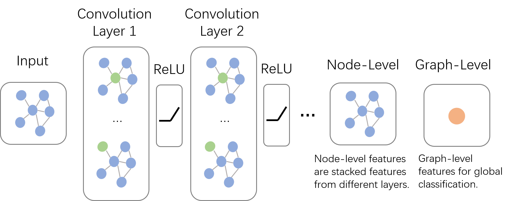

# 萊弗拓 -- sciMallNetworkScore



### 主要內容

结合基因对调控网络，基于图算法对Pathway（Gene Set）进行评分。

##### 1. 预处理

利用已知的基因网络，对每个sample的基因表达谱构造一个带权有向图。权重的设置规则如下：

1. 若基因A促进基因B（A => B），那么A => B边的权重为 Gene(A) - Gene(B)
2. 若基因B抑制基因C（B =| C），那么B => C边的权重为 -1 * ( Gene(B) - Gene(C) )

经过预处理后，基因表达谱会构造成一个基因网络图，我们将针对基因网络图对每个PathWay（Gene Set）进行打分。

##### 2. 图嵌入

基于随机游走理论模型，我们使用Node2vec算法生成结合DFS和BFS对随机序列，使用skip gram来训练。我们将得到一个图向量矩阵来表示整个图，每个节点用一个向量来表示。
把基因网络图嵌入到向量空间之后，相近的节点会在向量空间中有更大的相似度（余弦空间上更相近）。

##### 3. 排序

为了清楚每个节点在调控网络的重要性，我们构造了一个p*p对基因关系矩阵R（p是值基因的数目）。R[i][j]表示基因I和基因J在余弦空间的相似度。按照axis=1进行求和后排序，我们可以得到节点在余弦空间上对基因网络对重要性排序。

#### 4. 求富集分数

我们使用Kolmogorov-Smirnov近似随机游走对上面对结果生成一个rank distribution。

然后使用如下公式计算ES （Enrich statistic)

ES = Vjk[ argmax | Vjk(l) | ]


### 测试操作

使用了一个很普通对带权有向图进行测试，**理论上来说可以求对任何图中部分节点的富集分数。**

```
    python geneSetsScores/main.py

```


